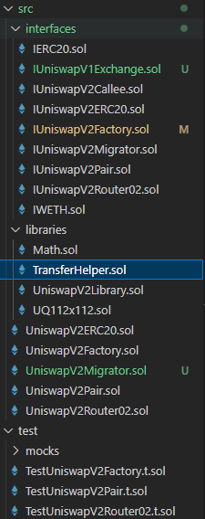
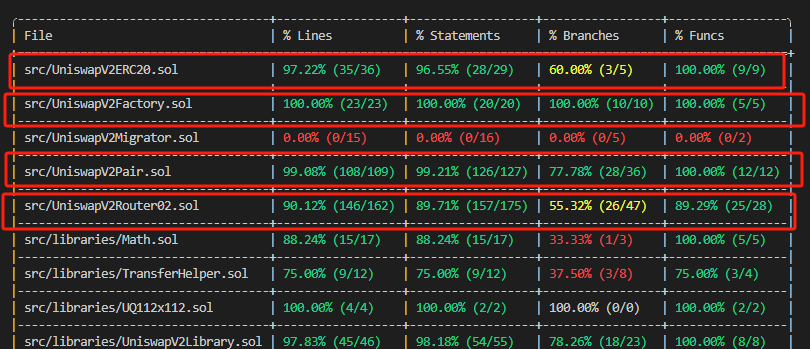

# HW5 DiLiu UniswapV2 Rewrite

**Github URL**: https://github.com/DiLiuNEUexpresscompany/HW5DiLiuUniswapV2Rewrite

---

## Build Foundry

Installation via `Foundryup`
```bash
curl -L https://foundry.paradigm.xyz | bash
```
Then run:
```bash
foundryup
```
Initialising a Foundry Project
```bash
forge init my-foundry-project
cd my-foundry-project
```
Solidity version: 0.8.13

---

## Rewrite UniswapV2


### interface

---

#### IERC20.sol
```solidity
// SPDX-License-Identifier: MIT
pragma solidity ^0.8.13;

interface IERC20 {
    function totalSupply() external view returns (uint256);
    function balanceOf(address account) external view returns (uint256);
    function transfer(address recipient, uint256 amount) external returns (bool);
    function approve(address spender, uint256 amount) external returns (bool);
    function transferFrom(address sender, address recipient, uint256 amount) external returns (bool);
}
```

- Define **ERC-20 standard interfaces** for **token transfers** and **authorisations**.

---

#### IUniswapV2ERC20.sol
```solidity
// SPDX-License-Identifier: MIT
pragma solidity ^0.8.13;

interface IUniswapV2ERC20 {
    function totalSupply() external view returns (uint);
    function balanceOf(address owner) external view returns (uint);
    function approve(address spender, uint value) external returns (bool);
    function transferFrom(address sender, address recipient, uint value) external returns (bool);
}
```

- Defines the standard interface for **Uniswap V2 LP (Liquidity Provider) tokens**.
- Inherits ERC-20 and supports liquidity mining.

---


#### IUniswapV2Factory.sol
```solidity
// SPDX-License-Identifier: MIT
pragma solidity ^0.8.13;


interface IUniswapV2Factory {
    event PairCreated(address indexed token0, address indexed token1, address pair, uint);

    function feeTo() external view returns (address);
    function feeToSetter() external view returns (address);

    function getPair(address tokenA, address tokenB) external view returns (address pair);
    function allPairs(uint) external view returns (address pair);
    function allPairsLength() external view returns (uint);

    function createPair(address tokenA, address tokenB) external returns (address pair);

    function setFeeTo(address) external;
    function setFeeToSetter(address) external;

    function getExchange(address) external view returns (address);
}

```

- **Uniswap V2 factory contract** for creating new **Pairs**.
- Allows to query **existing Pair addresses**.

---

#### IUniswapV2Pair.sol

- **Core Liquidity Pool (Pair) contract** for the exchange, liquidity provision and destruction of LP tokens.
- Allows for **queries about reserves** and performs **token swaps**.

---

#### IUniswapV2Router02.sol

- Responsible for **token exchange** and **liquidity addition** logic.
- Allows functions such as `swapExactTokensForTokens`, `addLiquidity`, etc. to be performed.

---

#### IUniswapV2Migrator.sol

- After migration, users can provide liquidity in Uniswap V2.

---

#### IWETH.sol
```solidity
// SPDX-License-Identifier: MIT
pragma solidity ^0.8.13;

interface IWETH {
    function deposit() external payable;
    function withdraw(uint amount) external;
}
```

- Interface for `WETH` tokens.
- Allows **ETH and WETH to be converted to each other**.

---
#### IUniswapV1Exchange.sol
```solidity
// SPDX-License-Identifier: MIT
pragma solidity ^0.8.13;

interface IUniswapV1Exchange {
    function getEthToTokenInputPrice(uint256 eth_sold) external view returns (uint256);
    function getTokenToEthInputPrice(uint256 tokens_sold) external view returns (uint256);
    function ethToTokenSwapInput(uint256 min_tokens, uint256 deadline) external payable;
    function tokenToEthSwapInput(uint256 tokens_sold, uint256 min_eth, uint256 deadline) external;
}
```
- Provides the core interface to the Uniswap V1 exchange.
- Allows querying the ETH to token exchange ratio.
- Allows ETH → Token and Token → ETH exchange.

---

#### IUniswapV2Callee.sol
```solidity
// SPDX-License-Identifier: MIT
pragma solidity ^0.8.13;

interface IUniswapV2Callee {
    function uniswapV2Call(address sender, uint amount0, uint amount1, bytes calldata data) external;
}
```
- Allows **External Contracts** to execute custom logic in **Uniswap V2 Lightning Loan** transactions.
- Specialised callback interface for **Flash Swap**.


---

### libraries

#### Math.sol
`Math.sol` is a Solidity maths library (Library) for performing **safe mathematical operations**. It provides basic mathematical operations such as addition, subtraction, and multiplication, as well as minimum (`min`) and square root (`sqrt`) calculations.

Due to version updates 0.8 and above do not need to consider the overflow problem, Solidity's own arithmetic symbols can be handled in version 0.8 and above.


#### TransferHelper.sol

`TransferHelper.sol` is a library of Solidity transfer tools for securely interacting with `ERC-20` tokens and `ETH`.
It mainly provides secure `approve`, `transfer`, `transferFrom`, and `ETH` transfer methods.


### UniswapV2ERC20.sol
|   **Modification Points**   | **Official Uniswap V2 version** | **Your modifications** |
| --------------------------- | ------------------------------- | ---------------------- |
| **Mathematical operations** | Use `SafeMath`                  | Use `Math.sol`         |
| **ERC-20 Permit**           | use `EIP-2612`                  | same structure         |
| **Event Logging**           | Logic is the same               | Logic is the same      |
| **Constructor**             | Compute `DOMAIN_SEPARATOR`      | Same structure         |


### UniswapV2Factory.sol

|            **Feature**            |                  **Your Version**                  |            **Official Uniswap Version**            | **Impact** |
| --------------------------------- | -------------------------------------------------- | -------------------------------------------------- | ---------- |
| **`feeTo` variable**              | `public`                                           | `public`                                           | Identical  |
| **`feeToSetter` variable**        | `public`                                           | `public`                                           | Identical  |
| **`getPair` mapping**             | `public`                                           | `public`                                           | Identical  |
| **`allPairs` array**              | `public`                                           | `public`                                           | Identical  |
| **Constructor**                   | `constructor(address _feeToSetter)`                | `constructor(address _feeToSetter)`                | Identical  |
| **`allPairsLength()`**            | `external view returns (uint)`                     | `external view returns (uint)`                     | Identical  |
| **`createPair()` logic**          | `require(tokenA != tokenB, 'IDENTICAL_ADDRESSES')` | `require(tokenA != tokenB, 'IDENTICAL_ADDRESSES')` | Identical  |
| **`create2` deployment**          | Uses `assembly`                                    | Uses `assembly`                                    | Identical  |
| **Pair initialization**           | `IUniswapV2Pair(pair).initialize(token0, token1);` | `IUniswapV2Pair(pair).initialize(token0, token1);` | Identical  |
| **Reverse mapping for `getPair`** | `getPair[token1][token0] = pair;`                  | `getPair[token1][token0] = pair;`                  | Identical  |
| **`setFeeTo()` function**         | Requires `feeToSetter` permission                  | Requires `feeToSetter` permission                  | Identical  |
| **`setFeeToSetter()` function**   | Requires `feeToSetter` permission                  | Requires `feeToSetter` permission                  | Identical  |

### UniswapV2Pair.sol
  
|              **Feature**              | **Your Version** | **Official Uniswap Version** | **Impact** |
| ------------------------------------- | ---------------- | ---------------------------- | ---------- |
| **Inherits `IUniswapV2ERC20`**        | ✅ Yes           | ✅ Yes                       | Identical  |
| **`Mint` event**                      | ✅ Yes           | ✅ Yes                       | Identical  |
| **`Burn` event**                      | ✅ Yes           | ✅ Yes                       | Identical  |
| **`Swap` event**                      | ✅ Yes           | ✅ Yes                       | Identical  |
| **`Sync` event**                      | ✅ Yes           | ✅ Yes                       | Identical  |
| **`MINIMUM_LIQUIDITY()` function**    | ✅ Yes           | ✅ Yes                       | Identical  |
| **`factory()` function**              | ✅ Yes           | ✅ Yes                       | Identical  |
| **`token0()` function**               | ✅ Yes           | ✅ Yes                       | Identical  |
| **`token1()` function**               | ✅ Yes           | ✅ Yes                       | Identical  |
| **`getReserves()` function**          | ✅ Yes           | ✅ Yes                       | Identical  |
| **`price0CumulativeLast()` function** | ✅ Yes           | ✅ Yes                       | Identical  |
| **`price1CumulativeLast()` function** | ✅ Yes           | ✅ Yes                       | Identical  |
| **`kLast()` function**                | ✅ Yes           | ✅ Yes                       | Identical  |
| **`mint()` function**                 | ✅ Yes           | ✅ Yes                       | Identical  |
| **`burn()` function**                 | ✅ Yes           | ✅ Yes                       | Identical  |
| **`swap()` function**                 | ✅ Yes           | ✅ Yes                       | Identical  |
| **`skim()` function**                 | ✅ Yes           | ✅ Yes                       | Identical  |
| **`sync()` function**                 | ✅ Yes           | ✅ Yes                       | Identical  |
| **`initialize()` function**           | ✅ Yes           | ✅ Yes                       | Identical  |


### UniswapV2Router02.sol

|              **Feature**              | **Your Version** | **Official Uniswap Version** | **Impact** |
| ------------------------------------- | ---------------- | ---------------------------- | ---------- |
| **Inherits `IUniswapV2ERC20`**        | ✅ Yes           | ✅ Yes                       | Identical  |
| **`Mint` event**                      | ✅ Yes           | ✅ Yes                       | Identical  |
| **`Burn` event**                      | ✅ Yes           | ✅ Yes                       | Identical  |
| **`Swap` event**                      | ✅ Yes           | ✅ Yes                       | Identical  |
| **`Sync` event**                      | ✅ Yes           | ✅ Yes                       | Identical  |
| **`MINIMUM_LIQUIDITY()` function**    | ✅ Yes           | ✅ Yes                       | Identical  |
| **`factory()` function**              | ✅ Yes           | ✅ Yes                       | Identical  |
| **`token0()` function**               | ✅ Yes           | ✅ Yes                       | Identical  |
| **`token1()` function**               | ✅ Yes           | ✅ Yes                       | Identical  |
| **`getReserves()` function**          | ✅ Yes           | ✅ Yes                       | Identical  |
| **`price0CumulativeLast()` function** | ✅ Yes           | ✅ Yes                       | Identical  |
| **`price1CumulativeLast()` function** | ✅ Yes           | ✅ Yes                       | Identical  |
| **`kLast()` function**                | ✅ Yes           | ✅ Yes                       | Identical  |
| **`mint()` function**                 | ✅ Yes           | ✅ Yes                       | Identical  |
| **`burn()` function**                 | ✅ Yes           | ✅ Yes                       | Identical  |
| **`swap()` function**                 | ✅ Yes           | ✅ Yes                       | Identical  |
| **`skim()` function**                 | ✅ Yes           | ✅ Yes                       | Identical  |
| **`sync()` function**                 | ✅ Yes           | ✅ Yes                       | Identical  |
| **`initialize()` function**           | ✅ Yes           | ✅ Yes                       | Identical  |


## Test and Coverage
Build
```shell
$ forge build
```
Test
```shell
$ forge test -vvv
```
Coverage
```shell
$ forge coverage
```



