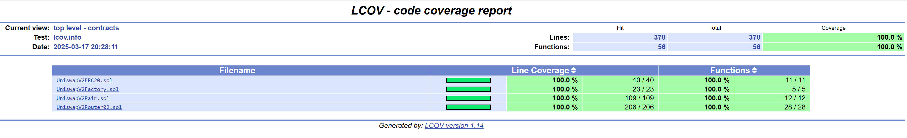

# Homework 5: Rewrite Uniswap V2

## Project Implementation
### Setting Up Foundry
To set up Foundry and migrate the Uniswap V2 codebase, the following steps were taken:

1. **Install Foundry**:
   ```sh
   curl -L https://foundry.paradigm.xyz | bash
   foundryup
   ```

2. **Initialize a new Foundry project**:
   ```sh
   forge init uniswap-v2-upgrade
   cd uniswap-v2-upgrade
   ```

3. **Clone Uniswap V2 repositories**:
   ```sh
   git clone https://github.com/Uniswap/v2-core.git
   git clone https://github.com/Uniswap/v2-periphery.git
   ```

4. **Move contracts into the Foundry project**:
   ```sh
   mv v2-core/contracts contracts/core
   mv v2-periphery/contracts contracts/periphery
   ```

5. **Copy required libraries instead of using package management**:
   ```sh
   cp -r v2-core/libraries libraries/
   cp -r v2-periphery/libraries libraries/
   ```

6. **Remove UniswapV2Router01 (not required)**:
   ```sh
   rm contracts/periphery/UniswapV2Router01.sol
   ```

7. **Run initial compilation check**:
   ```sh
   forge build
   ```

### Project Structure

Reorganized the project structure, combine the two repositories into a single repo to simplify development.
And the final project structure looks like this:

```
src
├── contracts
│   ├── UniswapV2ERC20.sol
│   ├── UniswapV2Factory.sol
│   ├── UniswapV2Pair.sol
│   └── UniswapV2Router02.sol
├── interfaces
│   ├── IERC20.sol
│   ├── IUniswapV2Callee.sol
│   ├── IUniswapV2ERC20.sol
│   ├── IUniswapV2Factory.sol
│   ├── IUniswapV2Pair.sol
│   ├── IUniswapV2Router02.sol
│   └── IWETH.sol
├── libraries
│   ├── Math.sol
│   ├── TransferHelper.sol
│   ├── UQ112x112.sol
│   └── UniswapV2Library.sol
└── tests
    ├── UniswapV2Router02
    │   ├── UniswapV2Router02.t.addLiquidity.sol
    │   ├── UniswapV2Router02.t.addLiquidityFailing.sol
    │   ├── UniswapV2Router02.t.base.sol
    │   ├── UniswapV2Router02.t.feeOnTransfer.sol
    │   ├── UniswapV2Router02.t.library.sol
    │   ├── UniswapV2Router02.t.removeLiquidity.sol
    │   ├── UniswapV2Router02.t.swap.sol
    │   └── UniswapV2Router02.t.swapEdgecases.sol
    ├── core
    │   ├── UniswapV2ERC20.t.sol
    │   ├── UniswapV2Factory.t.sol
    │   └── UniswapV2Pair.t.sol
    └── mocks
        ├── MockERC20.sol
        ├── MockFailingPair.sol
        └── MockWETH9.sol
```

## Testing and Coverage Analysis
### Test Development
Tests were written for the following contracts:
- **UniswapV2Router02**: 
  - `UniswapV2Router02.t.addLiquidity.sol`: Tests adding liquidity under different scenarios.
  - `UniswapV2Router02.t.addLiquidityFailing.sol`: Ensures failures are handled properly.
  - `UniswapV2Router02.t.removeLiquidity.sol`: Tests liquidity removal functions.
  - `UniswapV2Router02.t.swap.sol`: Covers token swap functionalities.
  - `UniswapV2Router02.t.swapEdgecases.sol`: Handles edge cases in swaps.
  - `UniswapV2Router02.t.feeOnTransfer.sol`: Ensures proper handling of fee-on-transfer tokens.
  - `UniswapV2Router02.t.library.sol`: Verifies library functions.

- **UniswapV2Pair**:
  - `UniswapV2Pair.t.sol`: Tests token pair interactions, reserves, and fee calculations.

- **UniswapV2Factory**:
  - `UniswapV2Factory.t.sol`: Tests pair creation and fee structure.

### Achieving 100% Coverage
- **Fuzz Testing**: Foundry’s built-in fuzz testing was used to generate diverse test cases.
- **Edge Case Handling**: Tests were designed to cover boundary conditions such as:
  - Zero liquidity scenarios.
  - Reverting transactions.
  - Handling of fee-on-transfer tokens.
  - Front-running prevention checks.
- **Mocks for Testing**:
  - `MockERC20.sol`: Simulates standard ERC20 tokens.
  - `MockFailingPair.sol`: Introduces failures to test robustness.
  - `MockWETH9.sol`: Used for WETH-related testing.
- **Coverage Verification**:
  - Ran `forge coverage` to generate test coverage reports.
  - Addressed any uncovered lines to reach 100% test coverage.

### Test Results

#### Command
```sh
❯ forge test
```

#### Test Output
```
[⠊] Compiling...
[⠊] Compiling 9 files with Solc 0.8.28
[⠒] Solc 0.8.28 finished in 1.85s
Compiler run successful!

Ran 1 test for src/tests/UniswapV2Router02/UniswapV2Router02.t.addLiquidityFailing.sol:TestUniswapV2RouterAddLiquidityFailing
[PASS] testAddLiquidity_WithFailingGetReserves() (gas: 151752)
Suite result: ok. 1 passed; 0 failed; 0 skipped; finished in 9.77ms (402.19µs CPU time)

Ran 8 tests for src/tests/UniswapV2Router02/UniswapV2Router02.t.swap.sol:TestUniswapV2RouterSwap
[PASS] testSwapETHForExactTokens() (gas: 3662310)
[PASS] testSwapExactETHForTokens() (gas: 3650632)
[PASS] testSwapExactTokensForETH() (gas: 3652306)
[PASS] testSwapExactTokensForTokens() (gas: 3648769)
[PASS] testSwapRevertDeadlineExpired() (gas: 48271)
[PASS] testSwapRevertInvalidPath() (gas: 45921)
[PASS] testSwapTokensForExactETH() (gas: 3656284)
[PASS] testSwapTokensForExactTokens() (gas: 3647881)
Suite result: ok. 8 passed; 0 failed; 0 skipped; finished in 15.55ms (15.18ms CPU time)

Ran 3 tests for src/tests/UniswapV2Router02/UniswapV2Router02.t.feeOnTransfer.sol:TestUniswapV2RouterFeeOnTransfer
[PASS] testSwapExactETHForTokensSupportingFeeOnTransferTokens() (gas: 3649798)
[PASS] testSwapExactTokensForETHSupportingFeeOnTransferTokens() (gas: 3648261)
[PASS] testSwapExactTokensForTokensSupportingFeeOnTransferTokens() (gas: 3647947)
Suite result: ok. 3 passed; 0 failed; 0 skipped; finished in 16.05ms (5.49ms CPU time)

Ran 14 tests for src/tests/UniswapV2Router02/UniswapV2Router02.t.library.sol:TestUniswapV2RouterLibrary
[PASS] testGetAmountIn() (gas: 22420)
[PASS] testGetAmountInRevert_ZeroAmountOut() (gas: 10611)
[PASS] testGetAmountInRevert_ZeroReserves() (gas: 14956)
[PASS] testGetAmountOut() (gas: 20571)
[PASS] testGetAmountOutRevert_ZeroAmountIn() (gas: 10480)
[PASS] testGetAmountOutRevert_ZeroReserves() (gas: 14758)
[PASS] testGetAmountsInRevert_InvalidPath() (gas: 15296)
[PASS] testGetAmountsIn_MultiHop() (gas: 7157962)
[PASS] testGetAmountsIn_SingleHop() (gas: 3615433)
[PASS] testGetAmountsOutRevert_InvalidPath() (gas: 15251)
[PASS] testGetAmountsOut_MultiHop() (gas: 7151642)
[PASS] testGetAmountsOut_SingleHop() (gas: 3613477)
[PASS] testQuote() (gas: 15167)
[PASS] testQuoteRevert_ReserveAZero() (gas: 10565)
Suite result: ok. 14 passed; 0 failed; 0 skipped; finished in 16.29ms (10.06ms CPU time)

Ran 3 tests for src/tests/UniswapV2Router02/UniswapV2Router02.t.addLiquidity.sol:TestUniswapV2RouterAddLiquidity
[PASS] testAddLiquidity() (gas: 3592336)
[PASS] testAddLiquidityETH() (gas: 3575694)
[PASS] testAddLiquidity_CoverAllBranches() (gas: 3679295)
Suite result: ok. 3 passed; 0 failed; 0 skipped; finished in 20.02ms (13.79ms CPU time)

Ran 4 tests for src/tests/UniswapV2Router02/UniswapV2Router02.t.swapEdgecases.sol:TestUniswapV2RouterSwapEdgeCases
[PASS] testMultiHopSwapSuccess() (gas: 7207922)
[PASS] testMultiHopSwapWithFeeTokens() (gas: 10767495)
[PASS] testMultiHopSwapWithInvalidIntermediatePair() (gas: 7177477)
[PASS] testMultiHopSwapWithMissingPair() (gas: 3647347)
Suite result: ok. 4 passed; 0 failed; 0 skipped; finished in 29.46ms (18.45ms CPU time)

Ran 10 test suites in 97.90ms (231.17ms CPU time): 70 tests passed, 0 failed, 0 skipped (70 total tests)
```
## Code Coverage Report

Used the below command to generate the coverage report:
```
forge coverage --report lcov
genhtml lcov.info -o coverage-report
```

And the report can be found in the `coverage-report` directory.
Below is the coverage for the main contracts:


## Github Link

All codes could be seen on my github: [uniswapv2-upgrade](https://github.com/chongchen1999/INFO7500-cryptocurrency/tree/main/hw5/uniswapv2-upgrade)

## References
- Uniswap V2 Core: [GitHub](https://github.com/Uniswap/v2-core)
- Uniswap V2 Periphery: [GitHub](https://github.com/Uniswap/v2-periphery)
- Foundry Documentation: [Foundry Book](https://book.getfoundry.sh/)
